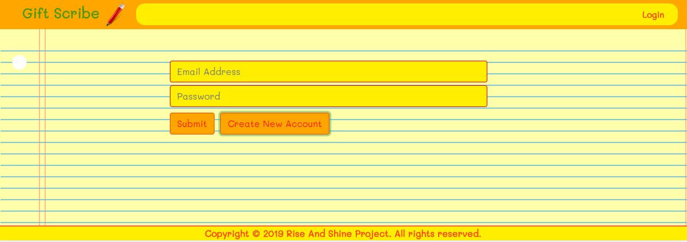
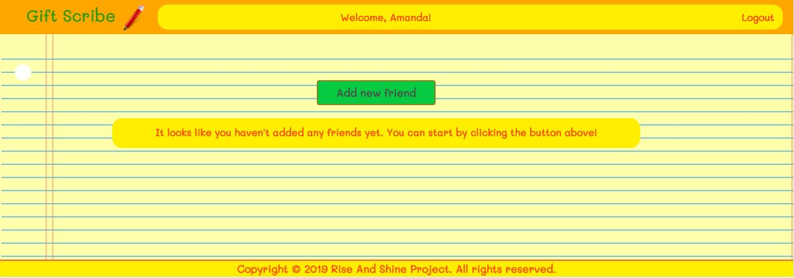
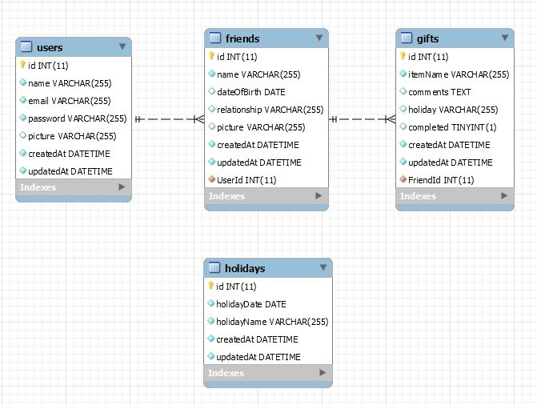
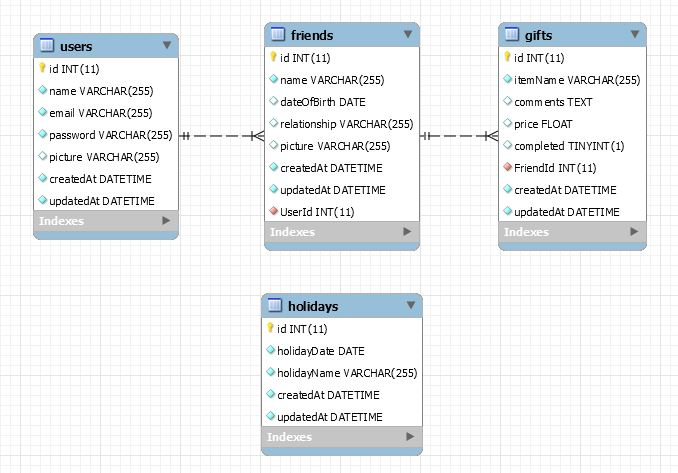
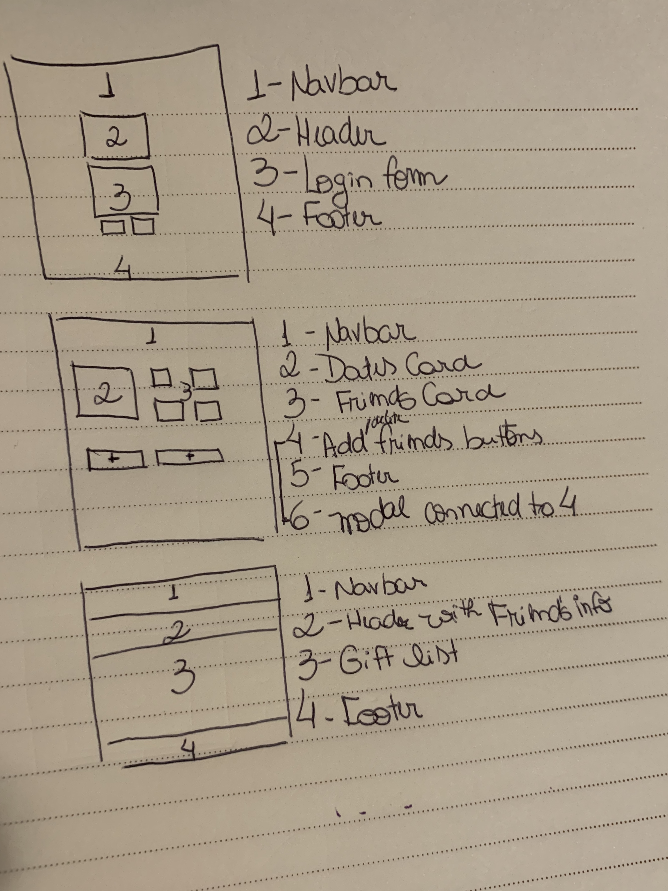

<h1>GiftScribe</h1>
<h2>An app to track gift ideas for friends and family.</h2>

Have you ever been to a store and thought something would be the perfect gift for someone you like? Then, how many times have you written that down and forgotten where you'd done that? Or how many times have you thought about writing it somewhere and completely forgot about it later?

If you've ever been through a similar situation, this app is for you! With GiftScribe, you'll be able to create customized lists of gifts for all your friends and family and access them anywhere.

Just create an account and start saving your ideas!

The app is deployed at https://gift-scribe.herokuapp.com/.

<h3>Release 1.0 Minimum Viable Product (MVP)</h3>

- Users are able to create an account, sign in, create separate lists of friends and add gifts to each friend.

<h3>Using the GiftScribe App</h3>

1. Go to https://gift-scribe.herokuapp.com/.

2. Click Create New Account and fill out the form.

3. Select Save New Account.

4. Click the "Add new friend" button and fill out the form with your friend's details.

5. Start adding gifts to that friend by selecting Add gift.

6. Once you've added gifts to your friends, you can view your lists by selecting See all gifts added.

<h3>MVP - How the App was developed</h3>

**Phase One - Brainstorming ideas:** While the group was brainstorming, Jake came up with the idea for GiftScribe. The need was identified after he had created a list of gift ideas for his wife and, all of the sudden, he lost it, wasting years worth of presents! 

**Phase Two - Defining MVP 1.0:** After agreeing on building GiftScribe, here are a few points the group considered important to cover:

- Layout - The website should be designed with mobile display as its first priority.

- Front End Functionality - Users would be able to create separate lists for each friend, and then add gifts to each specific list. 
Gifts can be categorized by holiday/event, optionally. 
When a holiday/event is within two weeks, the user should see a notification after logging in. 
The user will be able to see gifts by holiday, or by friend.
Users will also be able to mark gifts as completed and see what they've already bought to each friend in a separate page.
Once a gift is added to the page, we'll have a button where the user can click to visit the Amazon website and purchase that gift.

- Back End Logic - We'll have a Database with four tables: Users, Friends, Gifts and Holidays. Each user can have multiple friends and each friend can be associated to multiple gifts.
We should have a few API routes: read and write users, read, write, update and delete friends, read, write, update and delete gifts.

**Phase Three - Modeling the Database:** Once we had an idea of what to do, we started by modeling our Database. Here's how the DB was initially structured:

And here's how it currently is, after we've decided on a few changes for release 1.0 (which does not relate gifts to holidays anymore):

**Phase Four - Designing the App Components:** Then, we decided on which components we would create using React. This was the list: Sign In/Sign Up Form, Header, Footer, Friends List, and Gifts List. We also defined how we wanted to render these components on the page. Here's a draft of what we had (you'll see that we've made a few changes to it):

**Phase Five - Defining Routes:** After modeling our DB and designing our React Components, it was time to define our routes. These are the routes we've identified:

- React Routes: We would need four routes: a landing page, where users would see the Sign Up/Sign In form; a page to render the friends list, which would be pushed right after the user signed up/in; a separate page to render the gifts list after the user clicked the See Gifts button; a page to render results from the Amazon API. All the pages would render the Navbar and Footer. 

- API Routes: We would need several routes to accomplish what we had proposed: two routes (get and post) for users; four routes (get, post, put and destroy) for friends; four routes (get, post, put and destroy) for gifts that haven't been bought; three routes (get, put and destroy) for gifts that have already been bought.

**Phase Six - Identifying bugs and refining the app:** When we had most of our app working properly, we've tried to identify bugs and items that can be refined. Here's a few things that we came up with: when creating a friend, the greeting on the Navbar is changing and showing that friend's name, instead of the user name; we need to render error messages if the user is trying to sign in with an account that does not exist, or with the incorrect password; we should enter a few validation points in our forms (ex: a password must be between 6 and 10 characters).

<h3>MVP 1.0 - What was accomplished</h3>

- Layout - The website uses Bootstrap and CSS and is responsive.

- Front End Functionality - Users can create their accounts, add separate lists for each of their friends, add gifts to each one of them. 
Users can see all the gifts when selecting a list.
Users can mark gifts as completed and view the items that were previously bought to each friend in a separate page.

- Back End Logic - We have all the tables that were initially proposed, but in release 1.0, we've decided not to use the Holidays table.
We also implemented the following routes: read and write users; read and write friends; read, write, update and delete gifts.

<h3>The Team</h3>

**Amanda L. Ragone:** Back End/Front End

**Halon J. Hamilton:** Front End

**Jacob Smith:** Front End

**Mike Garringer:** Front End/Back End

**Troy Fasnacht:** Front End/Back End

<h3>Project Management</h3>

[Project Board - Release Version 1.0](https://github.com/rise-shine/Project-2/projects/1)

<h3>Future Direction</h3>

These are some functionalities that couldn't go into Release 1.0 and we would like to implement in future releases:
- Identifying when a date is approaching and alert the user after sign in;

- Implementing the Amazon (or another online reseller) API so that users can purchase items they've inserted in the lists;

- Deleting and updating friends;

- Adding a wishlist for the user, where can add ideas of items he/she would like to purchase.

- Adding a list to track gifts the user was gifted and who bought these gifts.
