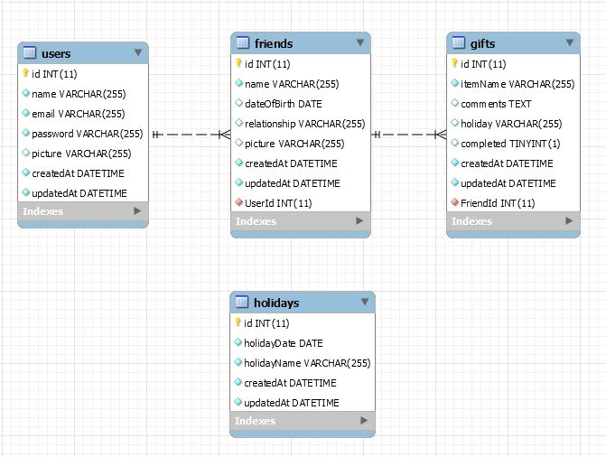

GiftScribe - An app to track gift ideas for fiends and family.

Layout for this app should be done with mobile display as first priority

Functionality - MVP

    * User logs gir ideas that are storin in a sql database
    * Gifts are categorized by holiday/event and recipient
    * User is alerted before holiday/event with gift ideas for that person
    * Queries can be run for specific holidays/events or people
    * Queries for previous gifts given to people
    * Amazon or some other retailer API used to search for gifts from the list
      and return links to items for sale

Functionality - Possible additions
_ wishlists
_ track gifts given to user and who they were from

Database Structure
Name: "giftreg"
Tables:
User: name,password,picture,email
Holiday: Holiday_name,Date,recipient,user
Recipient: name,relationship,picture,birthday,user
Gift: description,recipient,holiday,comment,user,gifted

Routes
Get
_ show recipients by user
_ show gift ideas by user(sorted by recipient)
_ gift ideas with in the next ??timeframe
Create
_ Add new gift idea
_ Add new user
_ Add new recipient
_ Add new holiday/event
Update
_ Edit gift idea(new comment, mark as gifted)
_ Edit Recipient data
_ Edit Holiday/event data

Required webpages
_ Landing page(login/create new user)
_ User homepage
_ modal for adding recipient
_ modal for adding event
_ modal for adding gift idea
_ Recipient page showing list and editing functions \* Page for returing api results

Initial DB Models

;
